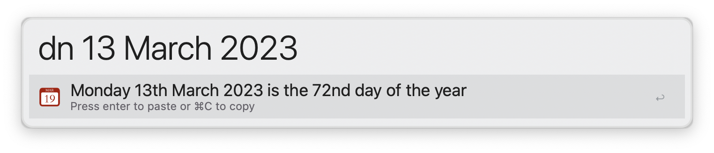
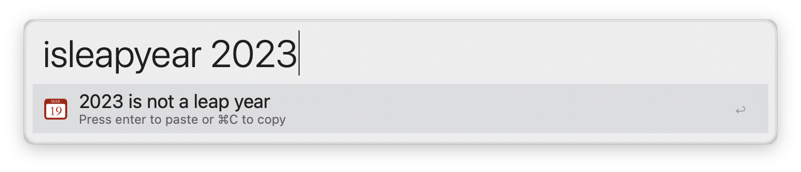

# Alfred Date Tools

Date related tools for use within [Alfred](https://alfredapp.com).

## Day Number

Type `dn` followed by a date to show the day number for a given date. This is a number between 1 and 366, so 1st Jan is *1*, 13 March 2023 is *72*, but 13 March 2024 is *73* as 2024 is a leap year.

This is also a quick way to find out the day of the week for a given day.

By default, it uses the keyword `dn` to initiate. This is configurable.

## Is Leap Year

Type `isleapyear` followed by a year to see if that year is a leap year or not.

# Configuration

The keywords used for Day Number and Is Leap Year are configurable on the Workflow's configuration page.

# Dependencies

This workflow depends on the GNU date utility found in [coreutils](https://formulae.brew.sh/formula/coreutils). The workflow assumes that the utility is named `gdate`.

This can be installed using Homebrew: `brew install coreutils`
